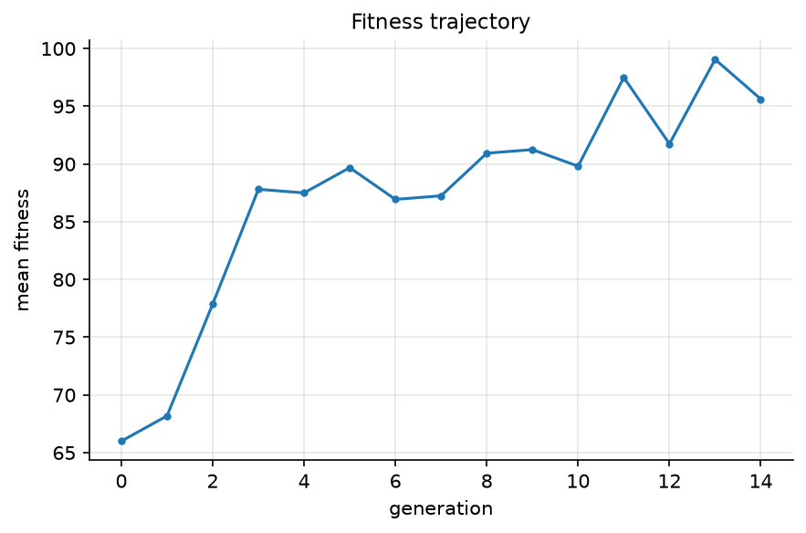
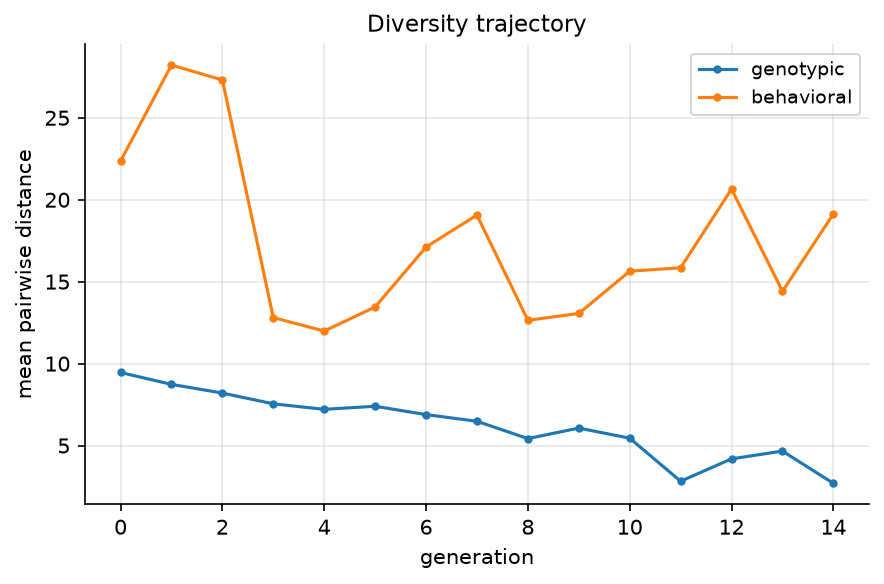
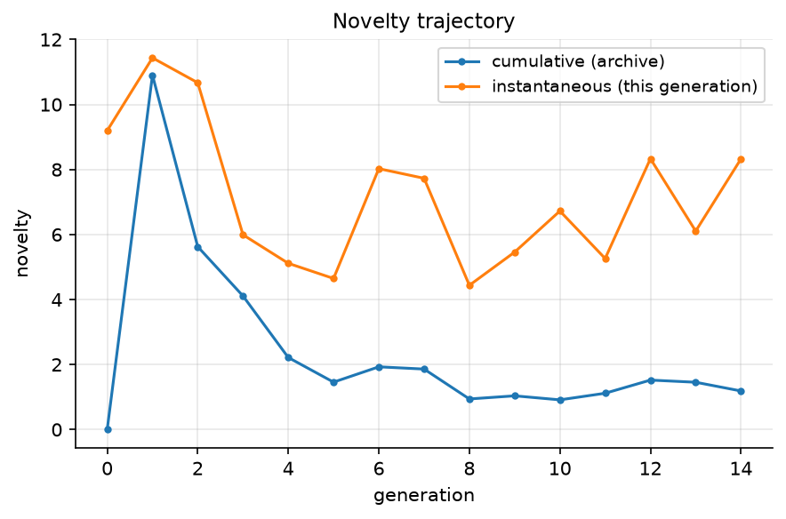
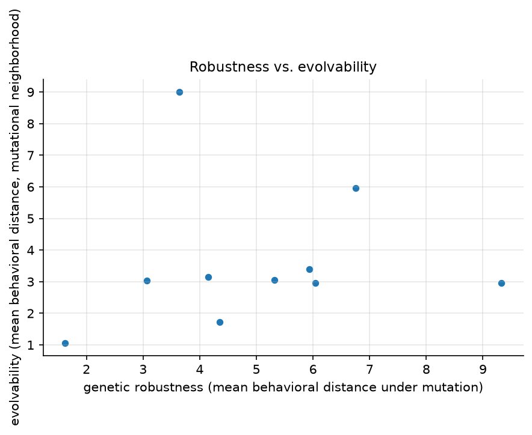
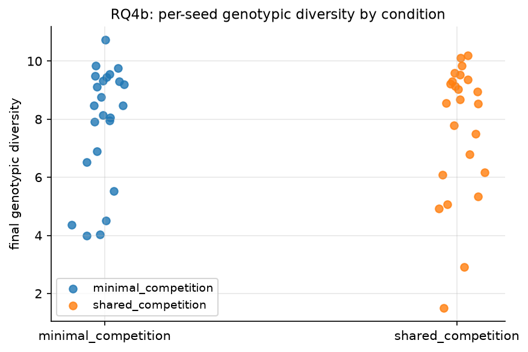
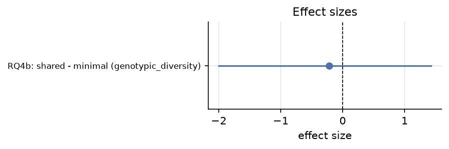
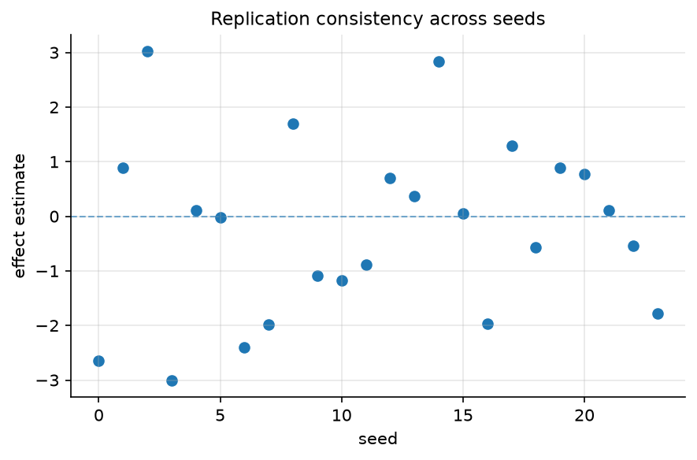
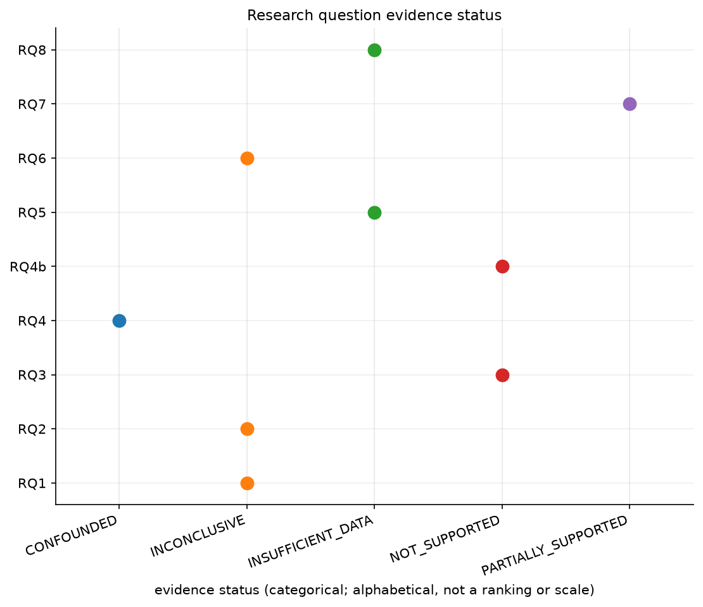

# GENEVRA Research Evidence Gallery

This gallery presents committed outputs generated by GENEVRA's experiments.
Figures are evidence artifacts, not decorative illustrations. Every figure
is traceable to an experiment configuration, seed set, metric definition,
and analysis output under [`research_evidence/`](../research_evidence/),
and is checked by `genevra verify-evidence` (checksum + manifest reference
integrity — see [`research_evidence/FIGURES.md`](../research_evidence/FIGURES.md)
for the full traceability index).

No figure below was generated for this gallery. Every PNG here was already
committed to `research_evidence/figures/` by
`genevra.evidence.build.build_evidence_package`, with one exception noted
in Section 4 (a categorical summary of the same statuses already in
`research_evidence/tables/research_question_matrix.csv`).

GENEVRA is an experimental research platform. Nothing below should be read
as a settled biological claim, and no result here validates or refutes any
cited paper — see
[`docs/final_research_status.md`](final_research_status.md) for the full
audit.

---

## 1. Evolutionary Dynamics

Source experiment: `case_a_evolvable_learning_seed0` (one seed of CASE A's
`evolvable_learning` condition, 15 generations). These three figures share
one trajectory — they are three metrics from the same single run, not three
independent experiments.

### Figure 1. Fitness trajectory

**Figure 1.** Mean population fitness across 15 generations for experiment
`case_a_evolvable_learning_seed0`. One value per generation from the stored
trajectory; no smoothing or interpolation is applied.

- **What is plotted:** `fitness_summary.mean` per generation.
- **Experiment/condition:** CASE A, `evolvable_learning` condition.
- **Seed information:** one seed (seed 0) of this condition — **this is one
  realized run, not an average over seeds.**
- **Metric:** mean fitness across the population at each generation.
- **What can actually be concluded:** this specific run's fitness moved in
  this specific way over 15 generations.
- **Limitation:** no cross-seed uncertainty band; a different seed can
  produce a different trajectory. Do not generalize this curve's shape.

### Figure 2. Diversity trajectory

**Figure 2.** Genotypic and behavioral diversity across 15 generations for
experiment `case_a_evolvable_learning_seed0`. One value per generation from
the stored trajectory; no smoothing or interpolation is applied.

- **What is plotted:** `genotypic_diversity` and `behavioral_diversity` per
  generation.
- **Experiment/condition:** same single seed/run as Figure 1.
- **Seed information:** one seed — single realized run.
- **Metric:** mean pairwise genotypic/behavioral distance (capped
  random-pair sample; see `diversity_max_pairs`).
- **What can actually be concluded:** how these two diversity measures
  moved together (or apart) in this one run.
- **Limitation:** capped pair sampling introduces sampling noise on top of
  the single-run limitation above.

### Figure 3. Novelty trajectory

**Figure 3.** Cumulative and instantaneous novelty across 15 generations
for experiment `case_a_evolvable_learning_seed0`. One value per generation
from the stored trajectory; no smoothing or interpolation is applied.

- **What is plotted:** `mean_novelty` (cumulative, relative to the archive)
  and `instantaneous_novelty` (this generation only).
- **Experiment/condition:** same single seed/run as Figures 1–2.
- **Seed information:** one seed — single realized run.
- **Metric:** novelty is relative to this run's own archive/population, not
  an absolute or cross-run scale.
- **What can actually be concluded:** the relative novelty pattern within
  this one run's own history.
- **Limitation:** not comparable to novelty values from a different run or
  archive; single-seed limitation from Figure 1 applies here too.

---

## 2. Robustness and Evolvability

### Figure 4. Robustness vs. evolvability

**Figure 4.** Evolvability plotted against robustness across 10
independently sampled genotypes (`rq2_robustness_evolvability`). Each point
is one genotype; no trend line is fit.

- **x-axis:** genetic robustness — mean behavioral distance under mutation
  (`genetic_robustness_mean`).
- **y-axis:** evolvability — mean behavioral distance across a mutational
  neighborhood (`evolvability_mean_behavioral_distance`).
- **n:** 10 sampled genotypes.
- **Correlation result:** Pearson r = 0.095 (seed-level), from
  `research_evidence/statistics/rq2_robustness_evolvability.json`.
- **Why this is exploratory/inconclusive:** n=10, and the required
  replication for RQ2 is only 3 seeds at minimum for a Pearson test to run
  at all — r=0.095 is close to zero and not distinguishable from no
  association at this sample size. The evidence status for RQ2 is
  `INCONCLUSIVE`, not "no relationship" and not "positive relationship."
  This is an association measurement only; **no causal direction is
  implied or testable from this design.**

---

## 3. Corrected Ecology Experiment (RQ4b)

This is the strongest evidence in the package because it is the one
research question with a large, pre-registered seed count (n=24/condition)
and a same-engine controlled design. It replaces RQ4, whose isolated-vs-shared
comparison used two structurally different engines (different selection
mechanism, generation structure, and sensory input dimensionality) and was
therefore re-labeled `CONFOUNDED` by an independent audit rather than
`SUPPORTED` — see
[`research_evidence/tables/rq4_historical_vs_corrected.md`](../research_evidence/tables/rq4_historical_vs_corrected.md).

RQ4b uses one engine (`ContinuousEvolutionEngine` + `SharedGridWorld`) for
both conditions, varying only `resource_a_density` (competition intensity
for a shared resource): 0.30 (`minimal_competition`) vs. 0.05
(`shared_competition`). n=24 independent seeds per condition. Analysis plan
frozen before execution in
`research_evidence/configurations/rq4_corrected_analysis_plan.json`.

**Committed values** (`research_evidence/statistics/rq4_corrected.json`):

| Quantity | Value |
|---|---|
| n per condition | 24 |
| minimal_competition mean | 7.890095 |
| shared_competition mean | 7.669304 |
| difference (shared − minimal) | −0.22079 |
| Cohen's d | −0.10082 |
| permutation p-value | 0.73025 |
| bootstrap 95% CI, minimal | [7.12119, 8.65274] |
| bootstrap 95% CI, shared | [6.65694, 8.54651] |
| replication agreement | 0.50 |
| sign reversals | 12 / 24 seeds |

### A. Seed-level observations

### Figure 5. RQ4b seed-level genotypic diversity

**Figure 5.** Final genotypic diversity for each of 24 independent seeds
per condition (`minimal_competition`: `resource_a_density=0.30`;
`shared_competition`: `resource_a_density=0.05`), same
`ContinuousEvolutionEngine` + `SharedGridWorld` configuration otherwise.
Individual seeds are shown, not only condition means; permutation p=0.7303,
Cohen's d=−0.10. Small horizontal jitter is for visual separation only and
carries no data.

The two conditions' point clouds overlap heavily and both show wide
within-condition spread (roughly 1.5 to 10.7) — the between-seed variation
within a single condition is much larger than the between-condition
difference in means.

### B. Effect size and uncertainty

### Figure 6. Effect size forest plot

**Figure 6.** Point estimate and 95% confidence interval for the RQ4b
effect size. A point-estimate label with no interval indicates the
interval could not be computed, not that the effect is exact.

The estimated effect (Cohen's d = −0.10) sits close to zero, consistent
with the permutation test's non-significant result (p=0.73).

### C. Replication consistency across independent seeds

### Figure 7. Replication consistency

**Figure 7.** Per-seed effect estimate plotted against seed, across the 24
seeds shared by both conditions. Each point is one independent seed's own
effect estimate (`ReplicationConsistencyReport.per_seed_effect`); this
shows sign/magnitude agreement across seeds, not a pooled significance
test.

12 of 24 seeds (50%) show a sign reversal relative to the pooled direction
— the pooled near-zero effect is not a case of many small, consistent
effects averaging out noise; it reflects genuine seed-to-seed disagreement
about which condition has higher diversity.

### Conclusion for RQ4b

**Status: `NOT_SUPPORTED`** for this specific tested ecology manipulation
(`resource_a_density`, 0.30 vs. 0.05) and this specific metric
(`genotypic_diversity`).

This means: no detectable effect of this specific competition-intensity
manipulation on this specific diversity metric was found, at this sample
size, in this simulation. It does **not** mean "ecology has no effect" and
it does **not** mean "GENEVRA proved ecology does not matter" — those are
broader claims this one experiment cannot support. A different ecological
parameter (e.g. `max_agents`, spatial structure), a different metric, or a
larger effect size than this design could detect at n=24/condition remain
untested.

---

## 4. Research Question Visual Summary

| RQ | Question | Evidence | Status | Main visual | Interpretation |
|---|---|---|---|---|---|
| RQ1 | Environmental change, plasticity, and genetic-diversity retention | `case_a_v1_period20`, 4 required seeds | `INCONCLUSIVE` | Fig. 1–3 (trajectories) | Evolvability approximated by standing diversity only; single environmental regime tested. |
| RQ2 | How does robustness relate to evolvability? | `rq2_robustness_evolvability`, n=10 genotypes | `INCONCLUSIVE` | Fig. 4 | Pearson r=0.095; association only, no causal claim. |
| RQ3 | Does current genetic diversity predict future novelty? | `case_a_v1_period20` | `NOT_SUPPORTED` | — (see `reports/RQ3.md`) | Leave-one-seed-out sign-agreement did not support the prediction. |
| RQ4 | Does ecological interaction structure affect evolutionary dynamics? | `exp1_isolated_vs_shared`, n=8/condition | `CONFOUNDED` | — (superseded by RQ4b) | Statistically significant, but the two engines differ in more than ecology; not attributable to ecology alone. |
| RQ4b | Corrected: does ecological competition intensity affect genotypic diversity within one engine? | `exp_ecology_corrected`, n=24/condition | `NOT_SUPPORTED` | Fig. 5–7 | See Section 3 above — the strongest, best-powered result in the package, and it is a null result. |
| RQ5 | Do independent runs converge on similar learning strategies? | `case_a_v1_period20`, 3 seeds | `INSUFFICIENT_DATA` | — | Descriptive spread only; one observation per seed, no significance test possible. |
| RQ6 | Which literature-inspired claims are supported in GENEVRA? | `case_a_v1_period20` | `INCONCLUSIVE` | Fig. 1–3 | Same underlying data as RQ1. |
| RQ7 | Under what environmental-change rates does the CASE A pattern change? | `case_a_boundary_sweep`, 4 seeds | `PARTIALLY_SUPPORTED` | — | Some but not all swept rates reproduce the pattern; see `reports/RQ7.md`. |
| RQ8 | Can the discovery engine generate testable follow-up hypotheses? | `case_a_v1_period20`, 2 seeds | `INSUFFICIENT_DATA` | — | No significance test; recurrence-based only. |

Statuses above are copied verbatim from
[`research_evidence/tables/research_question_matrix.md`](../research_evidence/tables/research_question_matrix.md)
(the authoritative source) — this table does not redefine or soften any
status.

### Figure 8. Research question evidence status (at a glance)

**Figure 8.** Evidence status of all 9 research-question rows in
`research_evidence/tables/research_question_matrix.csv`, grouped by
category. The x-axis is categorical and alphabetically ordered — it is
**not** a numeric score or a ranking; the statuses are not commensurable
across research questions (each uses a different metric, design, and
sample size). No research question in the current package is labeled
`SUPPORTED`. This figure makes visually explicit what the table above
states in words: GENEVRA has a working, checksum-verified research
infrastructure, but no broad confirmed scientific finding yet.

This figure is generated by
[`scripts/generate_research_question_summary_figure.py`](../scripts/generate_research_question_summary_figure.py)
directly from `research_evidence/tables/research_question_matrix.csv` — no
value on it is manually typed. Its provenance sidecar is
[`research_evidence/figures/research_question_summary.json`](../research_evidence/figures/research_question_summary.json),
and it is tracked in `research_evidence/manifest.json` and
`research_evidence/checksums/manifest.sha256` like every other figure in
this gallery.

---

## See also

- [`research_evidence/FIGURES.md`](../research_evidence/FIGURES.md) — full
  figure-by-figure traceability index (source data, report, statistics
  links).
- [`docs/research_evidence.md`](research_evidence.md) — how the evidence
  package is built and what it contains.
- [`docs/final_research_status.md`](final_research_status.md) — the
  independent audit that produced the `CONFOUNDED`/`NOT_SUPPORTED`
  corrections above.
- [`research_evidence/reports/negative_and_inconclusive_results.md`](../research_evidence/reports/negative_and_inconclusive_results.md)
  — every negative/inconclusive result in one place.
